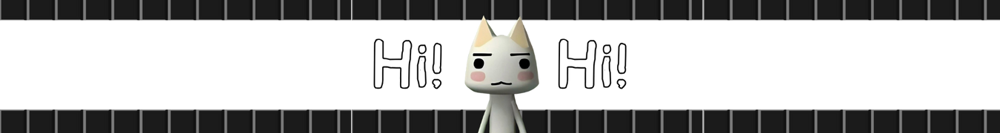
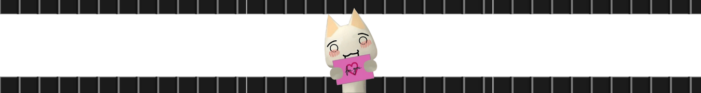

  

<h2 align="center">
  <strong>Hi, I'm Fadhil 👋👁️</strong>
</h2>

Just a regular software engineer "wannabe"

 

: under construction :

: under construction :

: under construction :

 

  
  
  

 

: under construction :

: under construction :

: under construction :

 

  

  

  

  

  

  

  

<!--

  

  

  

  

  

  

  

-->

<!--
**fadhil3310/fadhil3310** is a ✨ _special_ ✨ repository because its `README.md` (this file) appears on your GitHub profile.

Here are some ideas to get you started:

- 🔭 I’m currently working on ...
- 🌱 I’m currently learning ...
- 👯 I’m looking to collaborate on ...
- 🤔 I’m looking for help with ...
- 💬 Ask me about ...
- 📫 How to reach me: ...
- 😄 Pronouns: ...
- ⚡ Fun fact: ...
-->

📩 <a href="mailto:virgianofadhil@gmail.com">virgianofadhil@gmail.com</a> 📩

  

